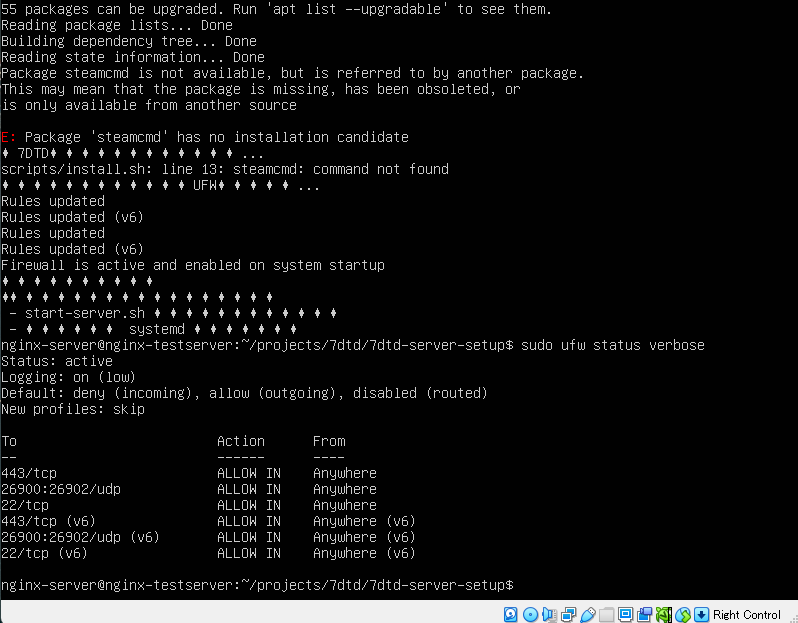
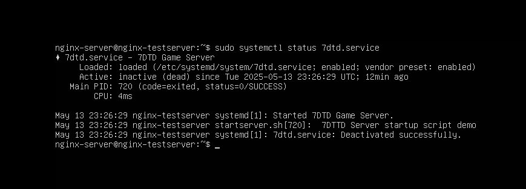

# 🎮 7 Days to Die Linuxゲームサーバー構築セットアップ

> このプロジェクトは、Linux（Ubuntu）環境において「7 Days to Die（7DTD）」のマルチプレイヤーゲームサーバーを自動構築・管理するためのセットアップスクリプトおよび設定ファイルをまとめたものです。

---

## 📁 ディレクトリ構成

```plaintext
7dtd-server-setup/
├── README.md             # 本ファイル（導入説明）
├── scripts/              # 起動・停止・バックアップ用スクリプト類
├── config/               # serverconfig.xmlなどの設定ファイル
├── images/               # 構成図や画面キャプチャ
└── docs/                 # 補足資料（メモや導入時の注意点など）
```

---

## 🚀 セットアップ手順

1. このリポジトリをクローン：

```bash
git clone https://github.com/itooni-misaki/7dtd-server-setup.git
cd 7dtd-server-setup
```

2. スクリプトに実行権限を付与（初回のみ）：

```bash
chmod +x scripts/*.sh
```

3. サーバーを起動：

```bash
./scripts/start-server.sh
```

※ スクリプトの中身は `scripts/` にて順次解説予定。

---

## ⚙️ 使用環境・前提条件

| 項目 | 内容 |
|------|------|
| OS   | Ubuntu Server 22.04 LTS |
| 必須 | `steamcmd`, `ufw`, `7dtd`本体インストール済 |
| 推奨 | rootまたはsudo権限ありのユーザー環境 |

---

## 🧱 主要ファイルの説明

| ファイル | 役割 |
|---------|------|
| `scripts/start-server.sh` | サーバーの起動用スクリプト |
| `config/serverconfig.xml` | ゲームサーバーの設定ファイル |
| `images/setup-flow.png` | サーバー構築手順の図解（任意追加） |

---

## 🔐 注意点とセキュリティ

- 公開前には必ず以下を確認してください：
  - 個人IP・メールアドレスなどの削除
  - APIキーやパスワードの伏せ忘れがないか
  - 実行ログに意図しない情報が含まれていないか

---

## 🧑‍💻 作者について

| 項目 | 内容 |
|------|------|
| 名前 | 平田 真樹（GitHub: [itooni-misaki](https://github.com/itooni-misaki)） |
| 専門 | Linux / サーバー構築 / インフラエンジニア志望 |
| 備考 | このリポジトリは就職活動向けポートフォリオの一環です。 |

---

## 📸 画面キャプチャ（任意）

> 実際の操作画面や構成図などは `/images` に格納しています。

---

## 📄 ライセンス

MIT License（予定・変更可）

## 🔐 セキュリティ設定（UFW）

本サーバーでは、最小限のポートのみを開放し、他の通信は全て遮断しています。

| ポート番号 | 用途               | プロトコル | 状態 |
|------------|--------------------|------------|------|
| 26900      | ゲーム接続         | UDP        | 許可 |
| 26901      | Steam接続          | UDP        | 許可 |
| 26902      | Web管理パネル（任意）| UDP      | 許可 |
| 22         | SSH（リモート接続）| TCP        | 許可 |

コマンド内容は [`config/ufw_rules.txt`](./config/ufw_rules.txt) に記載しています。

# 7DTD Server Setup on Ubuntu Server

このリポジトリは、Linux（Ubuntu Server）上で「7 Days to Die」の専用サーバー構築を行うためのスクリプト・設定ファイル・動作検証をまとめたものです。  
VS Code 上でファイルを編集し、GitHubでバージョン管理を行いながら、VirtualBox 上のUbuntu Serverで構築と起動テストを行いました。

---

## 📁 ディレクトリ構成

```
7dtd-server-setup/
├── server/
│   └── startserver.sh         # 自作の起動スクリプト
├── systemd/
│   └── 7dtd.service           # systemd サービス定義ファイル
├── config/
│   └── ufw_rules.txt          # UFW ルール構成（ポート開放）
├── images/
│   ├── ufw_status.png         # UFW ステータス確認キャプチャ
│   └── systemctl_status.png   # サービス起動状況のスクリーンショット
└── README.md
```

---

## ✅ 実施内容と検証項目

- Ubuntu Server 22.04 にて構築を実施
- `startserver.sh` によるサーバー起動スクリプトを自作
- systemd サービスとして登録（`7dtd.service`）
- `sudo systemctl enable/start/status` による起動と永続化を検証
- ファイアウォール（UFW）でポート26900（7DTD用）を開放
- GitHubリポジトリでスクリプト・設定・構成を一元管理

---

## 🧪 実行結果（検証）

### 🔹 ファイアウォール（UFW）設定確認

```bash
sudo ufw allow 26900/tcp
sudo ufw reload
sudo ufw status verbose
```

📸 ステータス出力：


---

### 🔹 サーバー起動のsystemd連携

```bash
sudo systemctl start 7dtd.service
sudo systemctl status 7dtd.service
```

📸 サービス起動結果：


---

## 💬 備考（制限事項）

現在、SteamCMDを用いた `7 Days to Die Dedicated Server` のバイナリ（App ID: 294420）の取得は、  
Steam側の仕様変更により失敗（`0x202` エラー）しており、サーバー本体の導入は未完了です。  
本リポジトリでは、構成ファイルの設計、起動スクリプトの作成、systemdによる永続化、UFW設定までを完了としています。

---

## 📌 技術的ポイント

- Linux 上での systemd サービス構築（構成・登録・起動・状態確認）
- 起動スクリプトの自作とファイル構成管理
- UFW によるポート制御とセキュリティ設定
- GitHub でのファイル管理・VS Code との連携によるローカル開発ワークフロー構築